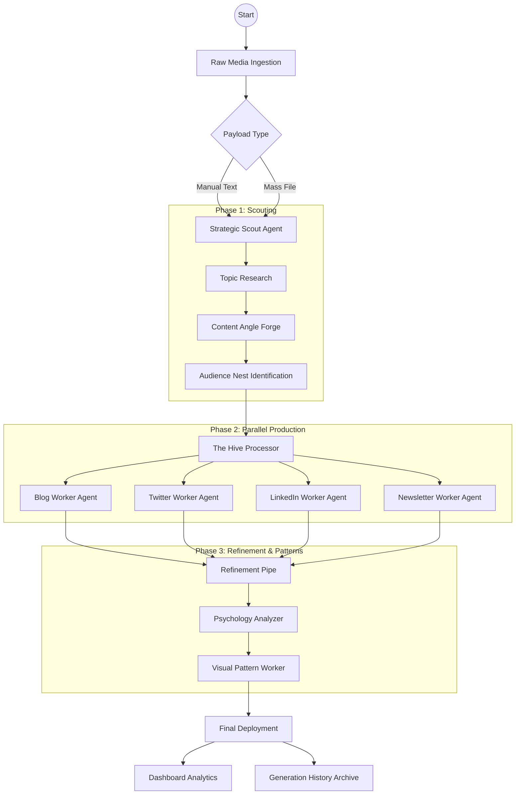

# ContANT AI | The Content Repurposing Colony 🐜

**ContANT AI** is a world-class multi-modal content engine designed to transform a single "source of truth" into a platform-native ecosystem of assets. Inspired by the efficiency of an ant colony, the platform leverages **Gemini 3 Flash** and **Gemini 2.5 Flash Image** to handle the heavy lifting of distribution, SEO, and psychological optimization.

---

## 🏗️ Project Flow Visualization



---

## 🏗️ Detailed Project Flow

The application follows a linear production pipeline, moving from raw data ingestion to high-fidelity, platform-specific outputs.

1.  **Ingestion:** User provides a raw payload via manual text entry or file upload (PDF, Audio, Video, Image).
2.  **Strategic Scouting:** The "Scout" worker analyzes the topic to identify audience pain points and content angles.
3.  **The Hive Processor:** Parallel "Worker" agents (Blog, Twitter, LinkedIn, Newsletter) generate draft variants simultaneously based on a persisted **Brand Voice**.
4.  **Refinement Pipe:** The "Structural" worker audits the drafts for cognitive biases, virality scores, and structural tension.
5.  **Visual Layer:** The "Pattern" worker generates professional marketing visuals to accompany the text assets.
6.  **Deployment:** Assets are archived in the History and visualized on the Dashboard.

---

## 📂 Project Structure

```text
├── App.tsx                 # Root component, handles global state (Theme, Toasts, Nav)
├── components/
│   ├── HomePage.tsx        # High-conversion landing page with interactive sandbox
│   ├── Dashboard.tsx       # Analytics hub with Recharts word-count tracking
│   ├── ContentCreator.tsx  # The main "Worker Hive" production pipeline
│   ├── ToolsPage.tsx       # Creative "Alchemist" tools (Emotion, Lore, Physics)
│   ├── SEOToolsPage.tsx    # "Scout Intelligence" suite (Keywords, Audit, SERP)
│   ├── BrandVoiceSettings.tsx # AI Training interface for tone/persona persistence
│   ├── AboutPage.tsx       # Philosophy, mission, and founder details
│   ├── Layout.tsx          # Nav/Footer logic with dynamic mobile menus
│   └── PricingPage.tsx     # SaaS tier visualization
├── services/
│   └── geminiService.ts    # Centralized logic for all AI agents & model configurations
├── types.ts                # Strict TypeScript definitions for content & SEO models
├── index.tsx               # React DOM entry point
└── index.html              # HTML5 template with Tailwind & Google Font injection
```

---

## 🛠️ The Working Toolkit

### 1. The Hive Processor (Repurposing)
*   **Blog Worker:** SEO-optimized long-form with meta descriptions.
*   **Twitter Worker:** Viral threads separated by semantic nodes.
*   **LinkedIn Worker:** Professional authority-building updates.
*   **Newsletter Worker:** Direct-response style engagement hooks.

### 2. The Alchemist Tools (Creative Power)
*   **Emotion Engine:** Injects psychological triggers (Nostalgia, Fear, Hope) at controlled intensities.
*   **Narrative Physics:** Graphs story tension against pacing using Gemini-driven data points.
*   **Resurrection Lab:** Pivots "zombie" (old) content into fresh angles like "Contrarian Flips."
*   **Psych Analyzer:** Simulates audience personas (Skeptical Buyer, Fan) to audit copy.

### 3. Scout Intelligence (SEO Suite)
*   **Keyword Architect:** Maps search intent and difficulty KD scores.
*   **SERP Simulator:** A/B previews of Google search result snippets.
*   **Gap Analysis:** Real-time comparison between user content and competitor strengths.

---

## ⚡ End-to-End Operational Flow

**Step 1: Pheromone Training (Brand Voice)**
Users define their persona, audience, and mandatory keywords. This state is persisted across sessions, ensuring the AI "workers" always speak with the user's unique DNA.

**Step 2: Payload Delivery**
User enters the "Create" interface and drops a payload. They select which platforms they want to "conquer."

**Step 3: Multi-Modal Parallel Generation**
The `geminiService` triggers multiple parallel calls to `gemini-3-flash-preview`. Each call is wrapped in specific system instructions tailored for that platform's constraints (e.g., character limits for X, Markdown for Blogs).

**Step 4: Interactive Refinement**
Using a "Highlight-to-Edit" interface, users can select any text block. A worker-input field appears, allowing them to give natural language orders (e.g., "Make this more punchy" or "Add a joke about ants") which triggers a contextual rewrite.

**Step 5: Visual Pattern Matching**
Once the text is finalized, the `IMAGE_MODEL` creates a tailored marketing graphic based on the themes identified in the text.

---

## 👨‍💻 Founder Details

**Enamul Hasan Shagato**
*   **GitHub:** [github.com/shagatomte19](https://github.com/shagatomte19)
*   **LinkedIn:** [linkedin.com/shagatomte19](https://linkedin.com/in/shagatomte19)
*   **Portfolio:** [shagatomte19.github.io](https://shagatomte19.github.io)

---

## 🚀 Technical Stack

*   **Runtime:** React 19 + Vite
*   **AI:** Google GenAI SDK (Gemini 3 Flash / 2.5 Flash Image)
*   **Styling:** Tailwind CSS (Custom "Glassmorphism" and "Colony" theme)
*   **Icons:** Lucide React
*   **Charts:** Recharts (Radar, Line, and Bar visualizations)

---
*ContANT AI — Turning your single idea into a global colony of influence.*