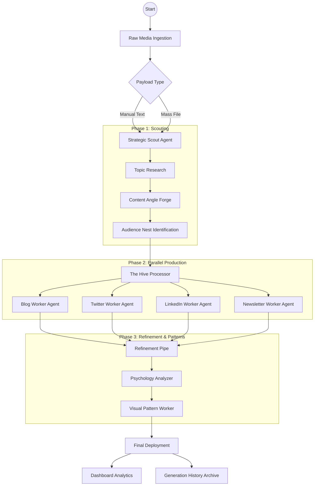

# ContANT AI | The Content Repurposing Colony 🐜

**ContANT AI** is a world-class multi-modal content engine designed to transform a single "source of truth" into a platform-native ecosystem of assets. Inspired by the efficiency of an ant colony, the platform leverages **Gemini 2.0 Flash** for AI-powered content generation and analysis.

---

## 🏛️ Architecture Overview

ContANT AI follows a modern **full-stack monorepo** architecture:

```
┌─────────────────────────────────────────────────────────────────┐
│                         FRONTEND                                 │
│                    React 19 + Vite + TypeScript                 │
│                      (Vercel Deployment)                         │
├─────────────────────────────────────────────────────────────────┤
│                            ↕ REST API                            │
├─────────────────────────────────────────────────────────────────┤
│                          BACKEND                                 │
│                FastAPI + Python + Supabase Auth                  │
│                     (Render Deployment)                          │
├─────────────────────────────────────────────────────────────────┤
│                    EXTERNAL SERVICES                             │
│         Gemini AI (Content) │ Supabase (Auth + Database)        │
└─────────────────────────────────────────────────────────────────┘
```

---

## 🏗️ Project Flow Visualization



---

## 📂 Project Structure

```text
ContANT/
├── backend/                          # FastAPI Backend
│   ├── app/
│   │   ├── __init__.py
│   │   ├── main.py                   # FastAPI application entry point
│   │   ├── config.py                 # Environment configuration
│   │   ├── routers/
│   │   │   ├── __init__.py
│   │   │   ├── content.py            # Content generation endpoints
│   │   │   ├── tools.py              # Power tools endpoints
│   │   │   └── seo.py                # SEO tools endpoints
│   │   ├── services/
│   │   │   ├── __init__.py
│   │   │   ├── gemini.py             # Gemini AI integration
│   │   │   └── auth.py               # Supabase auth & database
│   │   └── schemas/
│   │       ├── __init__.py
│   │       └── content.py            # Pydantic models
│   ├── requirements.txt              # Python dependencies
│   ├── .env.example                  # Environment template
│   └── render.yaml                   # Render deployment config
│
├── frontend/                         # React Frontend
│   ├── src/
│   │   ├── App.tsx                   # Root component
│   │   ├── index.tsx                 # React entry point
│   │   ├── types.ts                  # TypeScript definitions
│   │   ├── components/
│   │   │   ├── HomePage.tsx          # Landing page
│   │   │   ├── Dashboard.tsx         # Analytics hub
│   │   │   ├── ContentCreator.tsx    # Main production pipeline
│   │   │   ├── ToolsPage.tsx         # Creative power tools
│   │   │   ├── SEOToolsPage.tsx      # SEO intelligence suite
│   │   │   ├── BrandVoiceSettings.tsx # AI training interface
│   │   │   ├── Layout.tsx            # Navigation & layout
│   │   │   ├── AboutPage.tsx         # About page
│   │   │   └── PricingPage.tsx       # Pricing tiers
│   │   └── services/
│   │       └── api.ts                # Backend API client
│   ├── index.html                    # HTML template
│   ├── package.json                  # Node dependencies
│   ├── tsconfig.json                 # TypeScript config
│   ├── vite.config.ts                # Vite configuration
│   └── vercel.json                   # Vercel deployment config
│
├── README.md                         # This file
└── .gitignore                        # Git ignore rules
```

---

## 🚀 Quick Start

### Prerequisites

- **Node.js** 18+ and npm
- **Python** 3.10+
- **Supabase** account (for auth & database)
- **Google AI API Key** (Gemini)

### 1. Clone the Repository

```bash
git clone https://github.com/shagatomte19/ContANT.git
cd ContANT
```

### 2. Backend Setup

```bash
# Navigate to backend
cd backend

# Create virtual environment
python -m venv venv

# Activate virtual environment
# Windows:
venv\Scripts\activate
# macOS/Linux:
source venv/bin/activate

# Install dependencies
pip install -r requirements.txt

# Copy environment template and fill in your keys
cp .env.example .env
```

**Configure `.env` file:**
```env
GEMINI_API_KEY=your_gemini_api_key
SUPABASE_URL=your_supabase_project_url
SUPABASE_ANON_KEY=your_supabase_anon_key
SUPABASE_SERVICE_KEY=your_supabase_service_role_key
CORS_ORIGINS=http://localhost:5173
RATE_LIMIT=10/minute
```

**Start backend server:**
```bash
uvicorn app.main:app --reload --port 8000
```

### 3. Frontend Setup

```bash
# Navigate to frontend (from project root)
cd frontend

# Install dependencies
npm install

# Start development server
npm run dev
```

The frontend will be available at `http://localhost:5173`

---

## 🗄️ Database Setup (Supabase)

Create the following table in your Supabase project for content history:

```sql
-- Content History Table
CREATE TABLE content_history (
    id UUID DEFAULT gen_random_uuid() PRIMARY KEY,
    user_id UUID REFERENCES auth.users(id) ON DELETE CASCADE,
    format TEXT NOT NULL,
    content TEXT NOT NULL,
    original_title TEXT,
    psychology JSONB,
    image_url TEXT,
    created_at TIMESTAMP WITH TIME ZONE DEFAULT NOW()
);

-- Enable Row Level Security
ALTER TABLE content_history ENABLE ROW LEVEL SECURITY;

-- Policy: Users can only access their own content
CREATE POLICY "Users can manage their own content"
ON content_history
FOR ALL
USING (auth.uid() = user_id)
WITH CHECK (auth.uid() = user_id);

-- Index for faster queries
CREATE INDEX idx_content_history_user_id ON content_history(user_id);
CREATE INDEX idx_content_history_created_at ON content_history(created_at DESC);
```

---

## 🔌 API Endpoints

### Content Generation
| Method | Endpoint | Description |
|--------|----------|-------------|
| `POST` | `/api/content/generate` | Generate content for a specific format |
| `POST` | `/api/content/generate-batch` | Generate content for multiple formats |
| `POST` | `/api/content/modify` | Modify selected content |
| `POST` | `/api/content/psychology` | Analyze content psychology |
| `POST` | `/api/content/strategy` | Generate content strategy |
| `POST` | `/api/content/image` | Generate marketing image |
| `GET` | `/api/content/history` | Get user's content history |
| `DELETE` | `/api/content/history/{id}` | Delete history item |

### Power Tools
| Method | Endpoint | Description |
|--------|----------|-------------|
| `POST` | `/api/tools/hooks` | Generate contextual hooks |
| `POST` | `/api/tools/emotional` | Generate emotional content |
| `POST` | `/api/tools/narrative` | Analyze narrative physics |
| `POST` | `/api/tools/lore` | Generate brand lore |
| `POST` | `/api/tools/resurrect` | Resurrect old content |
| `POST` | `/api/tools/analyze` | Deep psychological analysis |

### SEO Tools
| Method | Endpoint | Description |
|--------|----------|-------------|
| `POST` | `/api/seo/keywords` | Generate SEO keywords |
| `POST` | `/api/seo/audit` | Perform SEO audit |
| `POST` | `/api/seo/meta` | Generate meta tags |
| `POST` | `/api/seo/gap` | Competitor gap analysis |
| `POST` | `/api/seo/backlinks` | Backlink strategy |
| `POST` | `/api/seo/local` | Local SEO recommendations |

---

## 🛠️ The Working Toolkit

### 1. The Hive Processor (Repurposing)
*   **Blog Worker:** SEO-optimized long-form with meta descriptions.
*   **Twitter Worker:** Viral threads separated by semantic nodes.
*   **LinkedIn Worker:** Professional authority-building updates.
*   **Newsletter Worker:** Direct-response style engagement hooks.

### 2. The Alchemist Tools (Creative Power)
*   **Emotion Engine:** Injects psychological triggers (Nostalgia, Fear, Hope) at controlled intensities.
*   **Narrative Physics:** Graphs story tension against pacing using AI-driven data points.
*   **Resurrection Lab:** Pivots "zombie" (old) content into fresh angles like "Contrarian Flips."
*   **Psych Analyzer:** Simulates audience personas (Skeptical Buyer, Fan) to audit copy.

### 3. Scout Intelligence (SEO Suite)
*   **Keyword Architect:** Maps search intent and difficulty KD scores.
*   **SERP Simulator:** A/B previews of Google search result snippets.
*   **Gap Analysis:** Real-time comparison between user content and competitor strengths.

---

## 🚢 Deployment

### Frontend (Vercel)

1. Connect your GitHub repository to Vercel
2. Set root directory to `frontend`
3. Add environment variable:
   ```
   VITE_API_URL=https://your-backend.onrender.com
   ```
4. Deploy!

### Backend (Render)

1. Connect your GitHub repository to Render
2. Create a new Web Service
3. Set root directory to `backend`
4. Set build command: `pip install -r requirements.txt`
5. Set start command: `uvicorn app.main:app --host 0.0.0.0 --port $PORT`
6. Add environment variables from `.env.example`
7. Deploy!

---

## 🔒 Security Features

- **API Key Protection:** Gemini API key stored server-side only
- **Supabase Auth:** JWT-based authentication with row-level security
- **Rate Limiting:** Configurable rate limits per endpoint (default: 10/minute)
- **CORS Protection:** Configurable allowed origins

---

## 🚀 Technical Stack

### Backend
*   **Framework:** FastAPI (Python 3.10+)
*   **AI:** Google GenAI SDK (Gemini 2.0 Flash)
*   **Auth & DB:** Supabase
*   **Rate Limiting:** SlowAPI
*   **Validation:** Pydantic v2

### Frontend
*   **Runtime:** React 19 + Vite
*   **Language:** TypeScript
*   **Styling:** Tailwind CSS (Custom "Glassmorphism" and "Colony" theme)
*   **Icons:** Lucide React
*   **Charts:** Recharts (Radar, Line, and Bar visualizations)

---

## 👨‍💻 Founder Details

**Enamul Hasan Shagato**
*   **GitHub:** [github.com/shagatomte19](https://github.com/shagatomte19)
*   **LinkedIn:** [linkedin.com/shagatomte19](https://linkedin.com/in/shagatomte19)
*   **Portfolio:** [shagatomte19.github.io](https://shagatomte19.github.io)

---

## 📄 License

MIT License - see [LICENSE](LICENSE) for details.

---

*ContANT AI — Turning your single idea into a global colony of influence.*